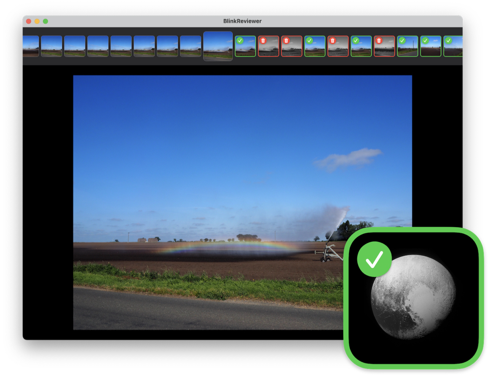
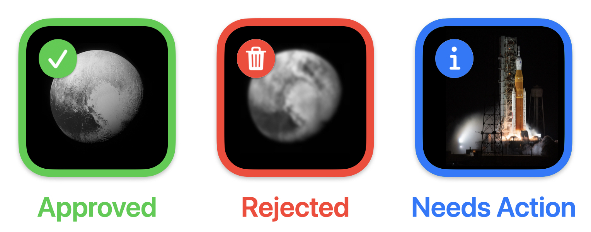

# blink-photo-reviewer

Blink is a lightweight Mac app I made to help me review my photo library.

I can navigate between photos with arrow keys, and it snaps between them, making it easy to compare similar photos and pick the best shot.
Once I've decided, I can use keyboard shortcuts to file each photo into one of three buckets: Approved, Rejected, and Needs Action.

I can also use single keystrokes to perform other review actions, like marking a photo as favourite or adding photos to key albums.

## Motivation

I have a lot of photos.
When I'm trying to get a shot, I'll often take multiple pictures in the hope of getting at least one that's good.
This means my camera roll is full of lots of similar images.

I always intend to go back and clean up my camera roll afterwards -- pick the best version of each shot, and delete all the rest.
In practice, I never did this review step -- I had no good way to track my progress, to know what I'd already reviewed and what was new.

This app is designed to make reviewing quick and easy.
I can flip between photos quickly, so I can compare shots and pick the one I like best.
Then with a few keystrokes, I can mark that photo as **Approved** and the other photos as **Rejected**, then move on.

I can also review a photo as **Needs Action**.
I use this when I need to do something with a photo, and I don't just want to keep it forever or delete it immediately -- useful, for example, for all the screenshots I've saved that should be turned into bug reports.

I can also add other categories.
In particular, I take a lot of photos of [my cross-stitch projects][cross-stitch], and I have an album with all of them.
I can add new photos to that album with one keystroke.

[cross-stitch]: https://alexwlchan.net/all-posts/?tag=cross-stitch
    
## How it works

When I review a photo in Blink, it gets filed into an album in my Photos Library.
It doesn't delete the photos – I have to go into Photos and do that manually.

(This is intentional.
I'm still new to using PhotoKit, and I don't want to hose my own photo library with a misplaced "delete photos" call.)

## What's in the name?

The name comes from [blink diffing], a technique used by astronomers to spot differences between two pictures of the night sky.
They'd rapidly "blink" between two pictures of the same patch of sky, and that helped them spot the difference.
I do the same thing to spot the difference between similar photos in my library.

Among other things, blink diffing was used to discover the planet Pluto in the 1930s, and the app's icon features an image of Pluto [from NASA's *New Horizons* spacecraft][nh_pluto].

[blink diffing]: https://en.wikipedia.org/wiki/Blink_comparator
[nh_pluto]: https://www.planetary.org/articles/09241425-lose-yourself-in-this-pluto

## Technology

The app is written in Swift and SwiftUI.
All the interactions with the Photos Library use the [PhotoKit framework].

[PhotoKit framework]: https://developer.apple.com/documentation/photokit

## Development status

I'm already using this app for my own photo library, but it's not suitable for anybody else to use (yet!).
Among other things, it will probably crash for you on first run – it relies on specific aspects of my photos library.

I'm gradually sanding off the rough edges and maybe it'll be suitable for other people eventually, but for now I'm only sharing it so other people can see and learn from my PhotoKit code.

## Prior art: Darkroom

Parts of this app are inspired by [Darkroom] and their [Flag & Reject workflow], but I've tried to put my own spin on it, including the third "Needs Action" state, and making it easier to find photos I haven't reviewed yet.

## Licence

MIT.
