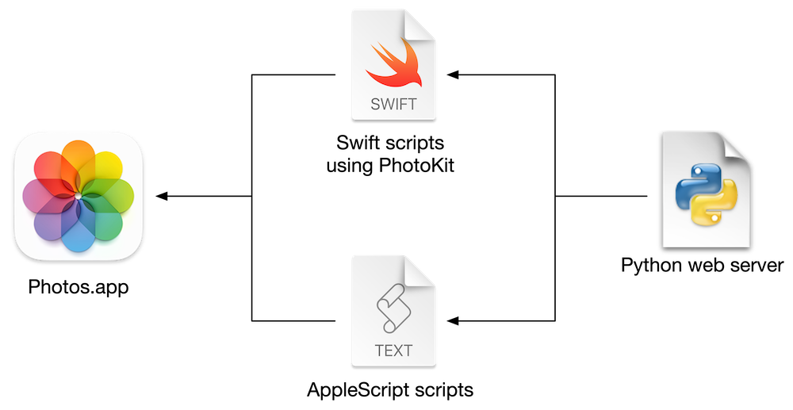

# photo-reviewer

This is a lightweight app for reviewing my photos from Photos.app.
I can navigate and review photos entirely using my keyboard.

This video shows you how I use it:

https://github.com/alexwlchan/photo-reviewer/assets/301220/dffbe69d-0717-40ef-a091-d06f40cc948e

Here's what's happening:

*   I use the arrow keys to switch between two similar photos, and compare them.
    Then I use `1`/`2` to approve one photo, and reject the other.
    Notice how the photos get a green/red border in the thumbnail viewer.
*   The next photo is a screenshot, which I need to take action on it.
    I press `3` to mark the photo as Needs Action; notice how it gets a blue border.
*   The final photo is one I've already approved; I press `f` to mark it as a favourite.
    Notice it gets a heart icon in the thumbnail.

I can use the following commands:

*   ⬅️ / ➡️ – navigate back and forth
*   1️⃣ – approve the photo, which adds it to the "Approved" album
*   2️⃣ – reject the photo, which adds it to the "Rejected" album
*   3️⃣ – add the photo to the "Needs Action" album
*   `f` – mark the photo as a favourite
*   `c` – add the photo to my "Cross stitch" album
*   `o` – open the photo in Photos.app
*   `u` – jump to the next photo which is unreviewed
*   `?` – jump to a random photo which is unreviewed


## Motivation

When I take photos, I often take a lot of similar shots so that I'm more likely to get a good picture.
This means I have a growing photo library full of pictures which are blurry/similar/duplicates – I'd like to filter down to just the best version of each shot.

A while back I tried using [Darkroom] and their [Flag & Reject workflow].
I like the idea, and I used it for a while, but the app was very buggy and slow on my Mac – it would sometimes crash, sometimes take 10+ seconds to switch between photos.

This app is my replacement for the reviewing portion of Darkroom – I can switch between photos quickly, and control it entirely using the keyboard.

[Darkroom]: https://darkroom.co/
[Flag & Reject workflow]: https://medium.com/@jasperhauser/manage-your-growing-darkroom-photo-library-with-flag-reject-77c9e1816ef2


## How it works



The UI is rendered by a Python web server.
On the rendered page, I capture keyboard input with the [`document.keydown` event][event], and this sends appropriate messages to the web server.

The web server runs scripts in a mixture of Swift/AppleScript, which update my photos in Photos.app as appropriate.
Most of the heavy lifting is done with the [PhotoKit framework].
I'm not touching the Photos SQLite database directly, or trying to analyse the structure of the Photos Library package.

If you're interested in the details of how I'm talking to Photos.app, you might want to look in the [actions folder](./actions).

[event]: https://developer.mozilla.org/en-US/docs/Web/API/Element/keydown_event
[PhotoKit framework]: https://developer.apple.com/documentation/photokit


## Usage

This is only designed for use on my Mac, so it might not work elsewhere.

If you want to try, you can start the app with:

```console
$ pip3 install --user requirements.txt
$ python3 server.py
```
